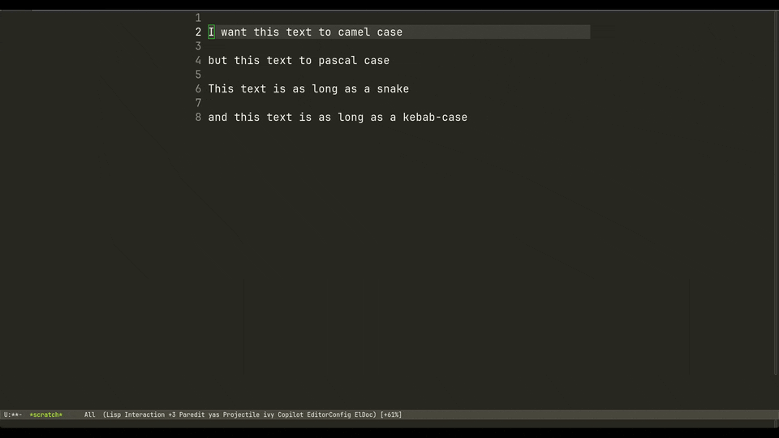

# format-region.el

Transform region in different formats: camelCase, kebap-case or lisp-case, PascalCase or snake_case.



## Usage

Select region and call:

### camelCase

```
M-x format-to-camel-case-region
```

### kebap-case o lisp-case

```
M-x format-to-kebap-case-region
```

or

```
M-x format-to-lisp-case-region
```

### PascalCase

```
M-x format-to-pascal-case-region
```

### snake_case

```
M-x format-to-snake-case-region
```

## Installation

1. Download `format-region.el` file.

2. Add this to your `~/.emacs` file:

```elisp
(add-to-list 'load-path "/path/to/format-region.el")
(require 'format-region)
```
